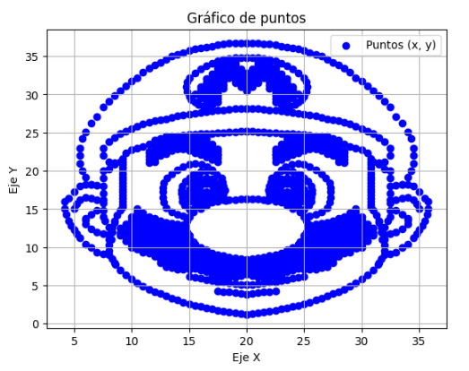
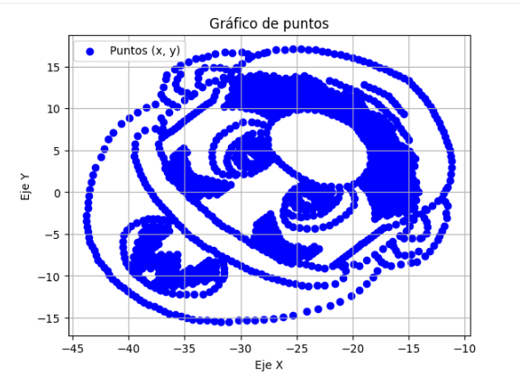
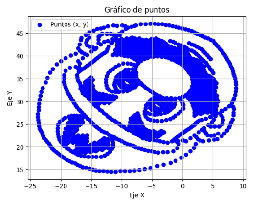

<h1 align="center">📊 Proyecto Álgebra Lineal.</h1>

<p align="center">
  
  
  
</p>

<p align="center">
  
  
  
</p>

<p align="center">
  <a href="https://github.com/jgarnigar/Proyecto-Algebra-Lineal/tree/master">
    
  </a>
</p>


## 🔍Descripción
- Los datos fueron encriptados multiplicando una matriz 6x6 por una matriz 6x1. El resultado es una matriz 6x1 con los datos encriptados. Estos datos nuevos ocultan una imagen. La nueva matriz 6x1 nos da los valores (x,y).

- Para desencriptar estos datos, obtendremos la matriz inversa de la matriz 6x6 y multiplicaremos por la 6x1 con los datos encriptados.

- Finalmente usaremos matplotlib con el fin de visualizar los datos desencriptados.


## 📸 **Vista rápida**

- Encriptación y desencriptación de datos con matrices 6x6.
- Visualización con Matplotlib.
- Estructura modular y clases bien definidas.

## Índice

🔍 [Descripción](#descripción)

📸 [Vista rápida](#-vista-rápida)

⚙️ [Estructura](#-estructura)

🧩 [Instalación y requisitos](#-instalación-y-requisitos)

💾 [Datos](#-datos)

▶️ 🚀 [Ejecución y uso](#funcionamiento)

- 🧮[Clases](#clases)

- 🧠 [Main](#main)

📈 [Resultados](#resultados)

- 📉 [Gráficos](#gráficos)

📜 [Ficha Técnica y Google Colab](#ficha-técnica--google-colab)

🗂️ [Estructura Completa](#estructura-completa)

🧰 [Tecnologías Usadas](#tecnologías-usadas)

👨‍💻 [Autor](#-autor)


## 🗂️ Estructura

📂 Proyecto Álgebra Lineal

 ┣ 📁 datos/          → Datos encriptados y desencriptados

 ┣ 📁 funciones/       → Funciones lógicas

 ┣ 📄 main.py        → Archivo principal de ejecución

 ┣ 📄 requirements.txt

 ┗ 📄 README.md

## ⚙️ Instalación y requisitos.
Utilizaremos **Python** 3.10 o superior, **Numpy** y **Matplotlib**. Para asegurarnos que todo funcione, por favor cree un entorno virtual.

***Instalar Python 3.10 o superior***

[Descargar Python](https://www.python.org/downloads/)

🖥️ ***Clone el repositorio:***

    git clone https://github.com/jgarnigar/Proyecto-Algebra-Lineal.git


⌨️ ***Crear el entorno virtual***
```bash
python -m venv venv
source venv/bin/activate     # Para Linux/Mac
venv\Scripts\activate        # Para Windows
```

💻 ***Instale los requerimientos***

    pip install -r requirements.txt

    
🚀 ***Ejecución del programa***

Una vez tengamos el repositorio clonado y todos los requisitos instalados, ejecute este código desde la carpeta principal:

    `python main.py`

> ⚠️ **Nota:** asegúrese de ejecutar este comando desde la carpeta raíz del proyecto!


## 💾 Datos
*Todos los datos fueron almacenados dentro de la carpeta datos*.

📦 Proyecto-algebra-linea

┣ 📂 datos > datos encriptados.txt 

┃ ┣ valores desencriptados.txt 

┃ ┣ valores rotados.txt

┃ ┣ valores trasladados.txt


## ▶️ 🚀 Ejecución y uso

Para desencriptar los datos hemos creado clases en python para poder obtener los datos desencriptados a través de los siguientes métodos:

### 🧮 Clases

- 🔹**App**:
    - Abre el archivo con los datos encriptados, pide si se encripta o desencripta y la matriz 6x6.

- 🔹**Cifrado**: 
    - Pide la matriz 6x6 y 6x1. Podemos encriptar los datos, desencriptar los datos y obtener la matriz inversa de la matriz 6x6.

- 🔹**Crear Array**:
    - Obtiene los valores para (x,y), de esta manera logramos graficar con matplotlib.

- 🔹**Desempaquetar**:
    - La clase app nos da arrays anidados, por lo que creamos arrays unidimensionales con la clase Desempaquetar.

- 🔹**Ecuacion**:
    - La matriz 6x6 fue dada a través de distintas ecuaciones, por lo que la resolvemos usando Numpy.

- 🔹**Rotacion**:
    - Obtenemos los datos (x,y) y los rotamos con el ángulo brindado. Nos brinda 2 arrays, uno para el eje (x) y otro para (y).

- 🔹**Traslacion**:
    - Pide los datos (x,y) y los trasladamos con los datos (a,b). Obtenemos también dos arrays, uno para (x) y otro para (y).

- 🔹**Graficar**:
    - Brindamos los datos (x,y), cada uno debe ser un array con todos los datos y los graficamos con matplotlib.

- 🔹**Guardar**:
    - Nos pide todos los datos para (x,y), cada uno en un array diferente y los guarda con el formato: (x, y).

### 🧠 Main
El archivo ***main.py*** es el archivo que utilizaremos para correr todo el programa.

1️⃣ Definimos la matriz 6x6 ya resuelta.
```bash
matriz_codificacion = np.array([
    [ 2,  3, -2,  5, -3,  8],
    [ 6,  5,  0, -9,  7,  4],
    [-7,  8,-10,  1, 11,  7],
    [11,  0,  8,  8, 12, -6],
    [10, -1,  4, -5, -12,  3],
    [ 4,  6,  2, -4,  9, -1]
], dtype=int)

```
2️⃣ Creamos las instancias para cada clase.
```bash
aplicacion = App()
rotar = Rotacion()
desempaquetador = Desempaquetar_Array()
graficar = Graficar()
traslacion = Traslacion()
guardar_datos = GuardarDatos()
cir = Cifrado()
create = crear_array()
```
3️⃣ Creamos las variables (x,y) con los datos desencriptados del archivo .txt brindado.
```bash
    valores_x, valores_y = aplicacion.abrir_document(matriz_codificacion, "datos/datos encriptados.txt", "decifrar")
```

4️⃣ Los arrays de (x,y) están anidados en arrays multidimensionales, así los convertimos en un array unidimensional.
```bash
desempaquetar_x, desempaquetar_y = desempaquetador.desempaquetar(valores_x, valores_y)
```

5️⃣ Rotamos los datos brindando el ángulo de rotación.
```bash
valores_rotados_x, valores_rotados_y = rotar.rotar_matriz(desempaquetar_x, desempaquetar_y)
```

6️⃣ Trasladamos los datos dando los parámetros (a,b).
```bash
valores_trasladados_x, valores_trasladados_y = traslacion.trasladar_matriz(valores_rotados_x, valores_rotados_y, 20, 30)
```

7️⃣ Graficamos con los datos desencriptados, rotados y trasladados.
```bash
graficar.graficadora(desempaquetar_x, desempaquetar_y)
graficar.graficadora(valores_rotados_x, valores_rotados_y)
graficar.graficadora(valores_trasladados_x, valores_trasladados_y)
```
8️⃣ Guardamos todos los datos en archivos nuevos.

```bash
guardar_datos.save(desempaquetar_x, desempaquetar_y, "datos/valores desencriptados.txt")
guardar_datos.save(valores_rotados_x, valores_rotados_y, "datos/valores rotados.txt")
guardar_datos.save(valores_trasladados_x,valores_trasladados_y,"datos/valores trasladados.txt")
```

## 📈 Resultados

### 📸 Gráficos

🎨 A continuación se muestran los gráficos generados por Matplotlib.

- 1️⃣ 🖼️ Gráfico con datos desencriptados.

<p align="center">
    
</p>

- 2️⃣ 🖼️ Gráfico con datos desencriptados y rotados.

<p align="center">
    
</p>

- 3️⃣ 🖼️ Gráfico con datos desencriptados, rotados y trasladados.

<p align="center">
    
</p>


## 📜 Ficha Técnica y Google Colab
⚠️
- Para un mayor detenimiento en el funcionamiento de cada función y explicación matemática, por favor visite la ***[Ficha Técnica](https://github.com/jgarnigar/Proyecto-Algebra-Lineal)***

- Para una mejor visualización del programa, por favor visite: ***[Google Colab, Proyecto](https://colab.research.google.com/drive/1CkWjWGpspBhHJBozxhsUjfhBi_t5p63E#scrollTo=CQJRhk_49ETw)***


## 🗂️ Estructura completa 

📦 Proyecto-algebra-linea

├─ 📁datos/

│   ├─ 📄 valores_trasladados.txt

│   ├─ 📄 datos_encriptados.txt

│   ├─ 📄 datos.txt

│   ├─ 📄 practica.txt

│   ├─ 📄 valores_desencriptados.txt

│   └─ 📄 valores_rotados.txt

│

├─ 📁funciones/

│   ├─ 📄 __init__.py

│   ├─ 📄 app.py

│   ├─ 📄 cifrado.py

│   ├─ 📄 crear_array.py

│   ├─ 📄 desempaquetar.py

│   ├─ 📄 ecuacion.py

│   ├─ 📄 graficar.py

│   ├─ 📄 guardar.py

│   ├─ 📄 rotacion.py

│   └─ 📄 traslacion.py

│

├─ 📁imagenes

│   ├─ 🖼️ datos_desencriptados.png

│   ├─ 🖼️ datos_rotados.png

│   └─ 🖼️ datos_trasladados.png

│

├─ 📄 clases.py

├─ 📄 ecuacion.py

├─ 📄 Instrucciones_proyecto_algebra_lineal.pdf

├─ 📄 README.md

├─ 📄 requirements.txt

└─ 📄 FICHA_TECNICA.md

## 🧰 Tecnologías usadas


| Tecnología |  | Función |
|-------------|-------|--------------|
| **Python** |  | Lenguaje principal |
| **NumPy** |  | Operaciones numéricas |
| **Matplotlib** |  | Gráficas y visualización |


## 👨‍💻 Autor 

<p align="center">
    Hecho con ☕ (quizá demasiado)! 
    <br>
    <i><b>Junior Eduardo Garniga Rojas</b></i></a>  👾

</p>


<p align="center">
    <a href="https://github.com/jgarnigar">
        
    </a>
</p>
